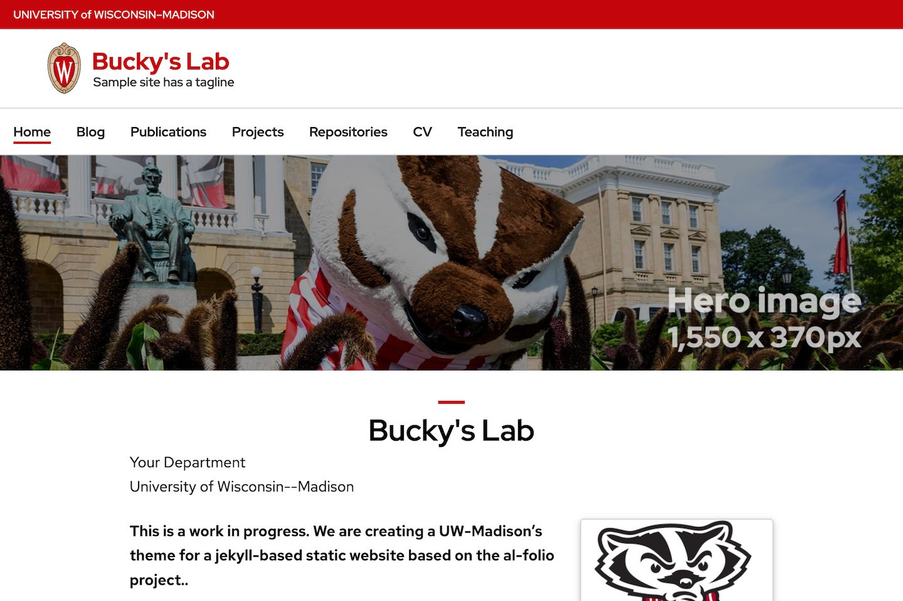

<p align="center">
  <div align="center">
    
  </div>
</p>

# UW Jekyll Template

This is a [Jekyll](https://jekyllrb.com) based website that is based upon the [Al-Folio](https://github.com/alshedivat/al-folio) framework and incorporates styling from the standard [UW HTML template](https://brand.wisc.edu/resource/html-templates/).


<div align="center">UW Jekyll Template Home Page</div>
<br />

## Applications

The UW Jekyll Template is intended to support the development of websites for the following types of University of Wisconsin people and organizations:

- department
- lab
- researcher or person
- organization

## Features

The UW Jekyll Template has built-in support for the following capabilities:

- blog
- list of publications
- list of projects
- list of GitHub repositories
- CV
- teaching, description of course materials

## Minimal required changes for website deployment

If you are starting with this repository as a template for your own project the following steps are required to have it be deployed as a GitHub Pages website.

1. In the GitHub Pages settings for your repository (`https://github.com/<your GitHub org>/<your GitHub repository name>/settings/pages`) under "Build and deployment" select "GitHub Actions" from the Source drop down menu.
   - [Relevant GitHub documentation](https://docs.github.com/en/pages/getting-started-with-github-pages/configuring-a-publishing-source-for-your-github-pages-site#publishing-with-a-custom-github-actions-workflow)
2. Find all instances of "uw-jekyll-theme" in the repository (e.g. `git grep "uw-jekyll-theme"`) and replace them with your repository name.
Add and commit these changes to your repository and push them to your remote on GitHub.
   * The only file that is **required** to be updated is `_config.yml`, but updating all files with the new repository name helps to avoid confusion later.

## Local development

### `pixi`

The easiest cross-platform method for local development is to use [`pixi`](https://pixi.sh/), as it provides a fully reproducible environment with all the required dependencies and build tools.

[Install `pixi`](https://pixi.sh/latest/#installation) and then (optionally) from the top level of the repository run

```
pixi install
```

Then use the `pixi` task runner to execute the tasks defined in `pixi.toml`.
First install the local Ruby "bundle"

```
pixi run install
```

and then run any defined task with `pixi run`, such as building and serving the website at `http://127.0.0.1:4000/uw-jekyll-theme/`

```
pixi run serve
```

You can see all the defined tasks in this project by running

```
pixi info
```

#### `rbenv`

Assuming you already have [Ruby](https://www.ruby-lang.org/en/downloads/) installed on your system, preferably with [`rbenv`](https://github.com/rbenv/rbenv), you can alternatively do local development by installing `bundler`

```
gem install bundle
```

then setting up local Ruby "bundle"

```
bundle install
```

and then build and serve the website at `http://127.0.0.1:4000/uw-jekyll-theme/` with

```
bundle exec rake serve
```

**Note:** If you use this development method, dependencies installed in the bundle will have external dependencies, like ImageMagick, that you will need to install yourself.

#### Docker

If you are running on Windows, we recommend that you run this application using Docker, which can be performed as follows:

- First, install [docker](https://docs.docker.com/get-docker/) and [docker-compose](https://docs.docker.com/compose/install/).
- Finally, run the following command that will pull a pre-built image from DockerHub and will run your website.

```bash
$ docker-compose up
```

Note that when you run it for the first time, it will download a docker image of size 300MB or so.

<!-- LICENSE -->
## License

Distributed under the MIT License. See `LICENSE` for more information.
